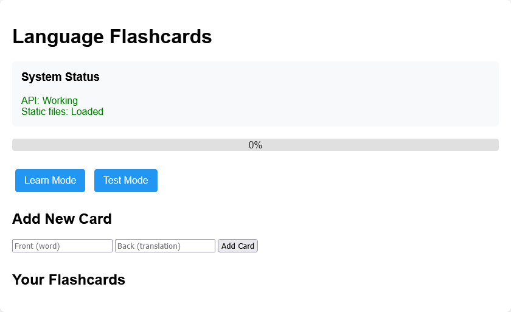
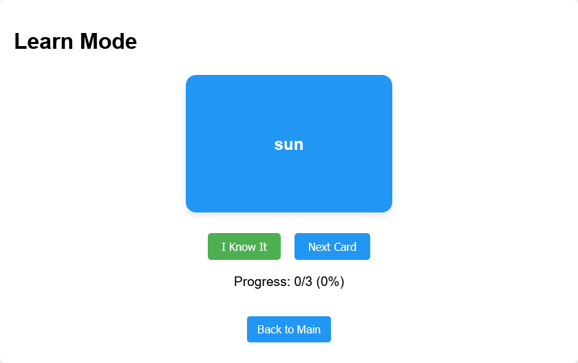
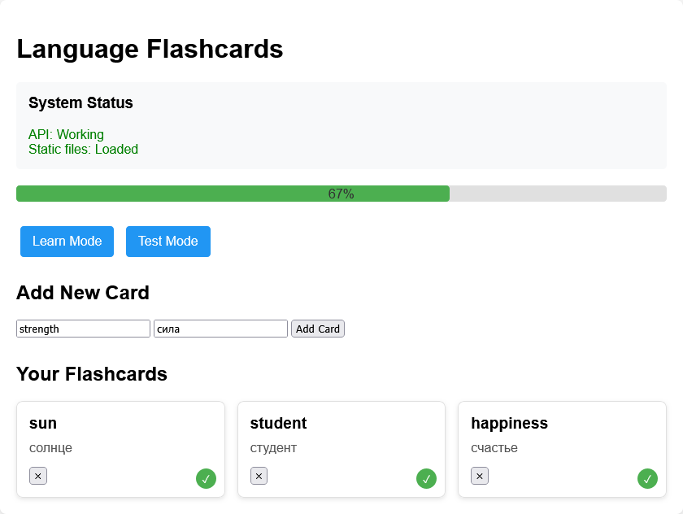
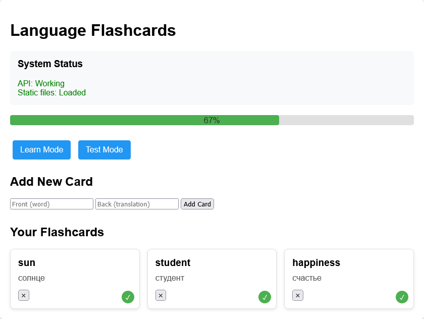

# 🗂 Language Flashcards App

[](https://flash-cards-app-nc6a.onrender.com)


🌍 **Рабочее приложение**: [https://flash-cards-app-nc6a.onrender.com](https://flash-cards-app-nc6a.onrender.com)

Приложение для изучения иностранных слов с интерактивными карточками.  
**Особенность**: система повторений и отслеживание прогресса.

## 🖥 Скриншоты

| Главная страница | Режим обучения |
|------------------|----------------|
|  |  |

| Добавление карточки | Прогресс |
|---------------------|----------|
|  |  |

## 🚀 Возможности
- ✨ Добавление/удаление карточек
- 🔁 Режим обучения с flip-анимацией
- 📊 Прогресс-бар с статистикой
- 📱 Адаптивный дизайн

## 🛠 Технологии
- **Frontend**: HTML5, CSS3, Vanilla JS
- **Backend**: Python + Flask
- **Database**: SQLite (автоматическая инициализация)
- **Хостинг**: [Render.com](https://render.com) (Free Tier)


## 🛠 Локальный запуск
```bash
# 1. Клонировать репозиторий
git clone https://github.com/TKVshnik/flash-cards-app.git
cd flash-cards-app

# 2. Установить зависимости
pip install -r requirements.txt

# 3. Запустить сервер
python app.py
```
Откройте в браузере: [http://localhost:5000](http://localhost:5000)

## 📄 Лицензия
MIT License | © 2023 [TKVshnik](https://github.com/TKVshnik)